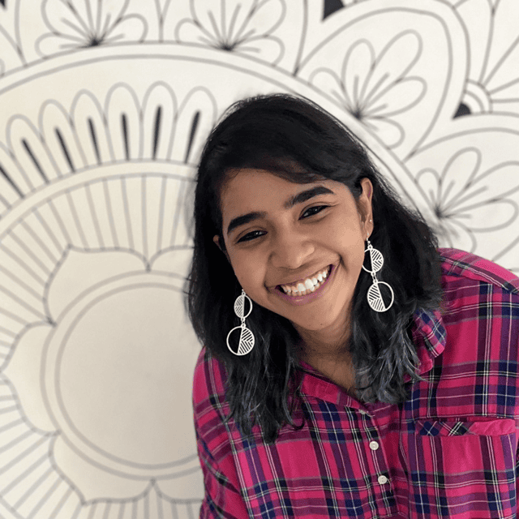
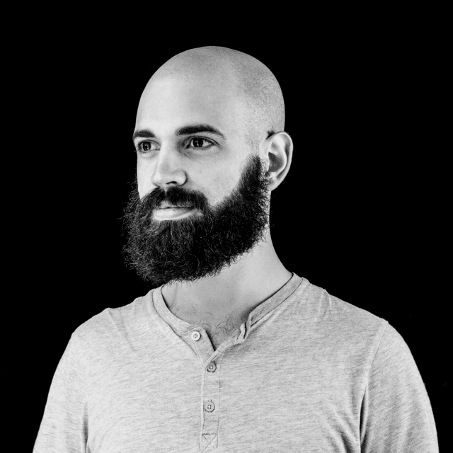
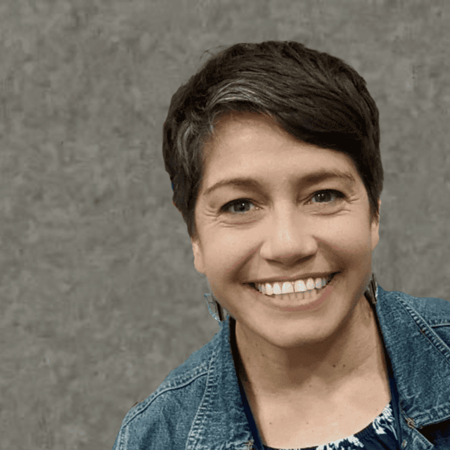
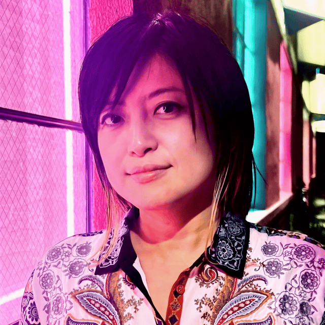

Processing Community Day is coordinated by [the Processing Foundation](https://processingfoundation.org/people), with support from contributors and volunteers across the Processing and p5.js community.

More about the work of the Processing Foundation: [https://processingfoundation.report/](https://processingfoundation.report/)

## About the Processing Foundation

The Processing Foundation is a non-profit organization established in 2012. Our mission is to promote software learning within the arts, artistic learning within technology-related fields, and to celebrate the diverse communities that make these fields vibrant, liberatory, and innovative. 

The Processing Foundation is specifically invested in expanding the communities of technology and the arts to support those who have not had equal access because of their race, gender, class, sexuality, immigration/documentation status, age, geographical location, and disability.

We work toward our goals by developing and distributing a group of related software projects, which includes Processing and p5.js, and run programs and initiatives that support the communities around these projects. We also provide resources for educators, students, and artists to learn and teach creative coding.

To read more about our mission, visit [processingfoundation.org](http://processingfoundation.org/). To learn about our activities, go to [processingfoundation.report](https://processingfoundation.report/).

Consider joining our [mailing list](https://processingfoundation.myflodesk.com/newslettersubscription) to be informed of our activities.

## Processing Community Day Committee

<section class="committee-member">

### Mathura M. Govindarajan

Mathura Govindarajan is a creative technologist, educator, and founder of Paper Crane Lab, a nonprofit makerspace in Bengaluru that believes making and tinkering is for everyone. She also teaches new media as an adjunct faculty at NYU, Srishti, NID, and other institutions. When she's not working, she paints walls, drinks coffee, and hangs out with cats.

</section>

<section class="committee-member">

### Raphaël de Courville

Raphaël de Courville (he/him) is a generative artist, designer, and educator from Paris. He currently serves as the Community Lead for the Processing project and is the worldwide coordinator for Processing Community Day. In 2012, he co-founded Creative Code Berlin, an initiative that fosters collaboration between artists and coders through monthly events. He lives and works in Berlin.

</section>

<section class="committee-member">

### Roxana Hadad

Roxana Hadad, PhD (she/her) has spent her career researching and developing equity-focused educational environments in computing. As a Latina and artist who knows firsthand the transformative impact of computing opportunities, Roxana is committed to expanding access to quality computing education for all learners. She is Co-Executive Director at the Processing Foundation.

</section>

<section class="committee-member">

### Xin Xin

Xin Xin (they/them) is a Taiwanese-American cultural producer exploring community-driven technology in creative and educational spaces. Xin advocates for liberatory software culture through the reclamation and subversion of power dynamics embedded within digital systems. Xin is Co-Executive Director at the Processing Foundation.

</section>

## Disclaimer

The Processing Foundation is not responsible for the planning, execution, or safety of individual events. Local organizers operate independently, and are solely responsible for their event. They must ensure it complies with local laws, venue requirements, and safety standards, and they must ensure that their event conforms to our [Safe Space Policy](/organize/code-of-conduct/).

The Processing Foundation is not liable for any damages, losses, or injuries that may occur during a PCD event. Organizers are encouraged to obtain appropriate insurance coverage and take necessary precautions to ensure the safety and well-being of all participants.

See also [Mentioning Processing Foundation](/organize/planning-your-event/promoting-your-event/#mentioning-processing-foundation) for the wording to use when you refer to PCD or the Foundation.
