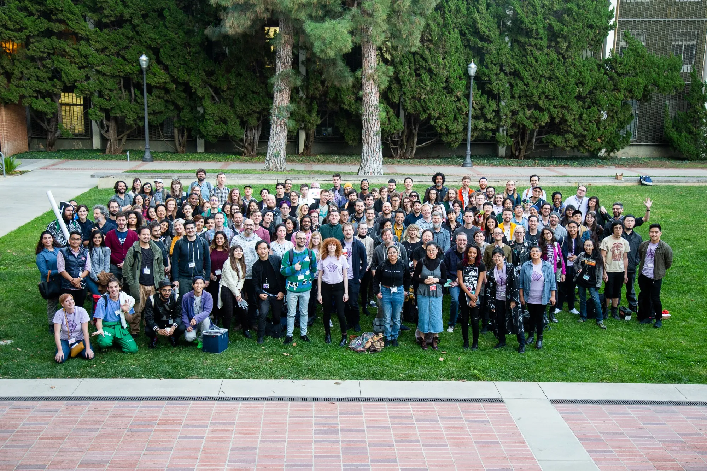
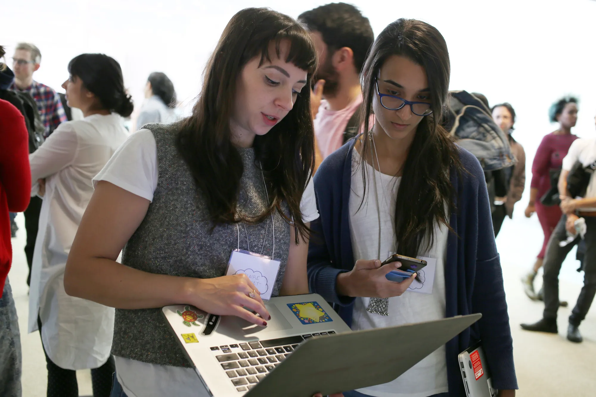
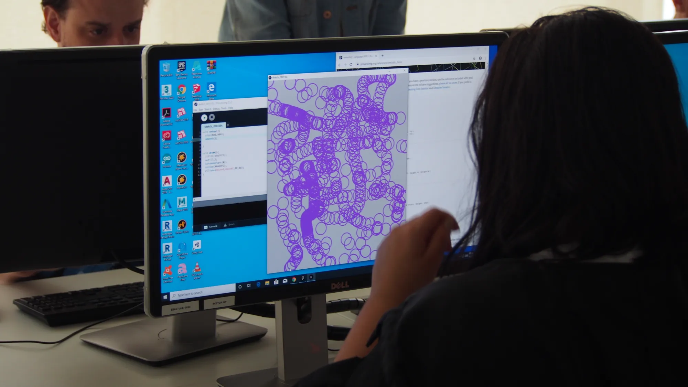
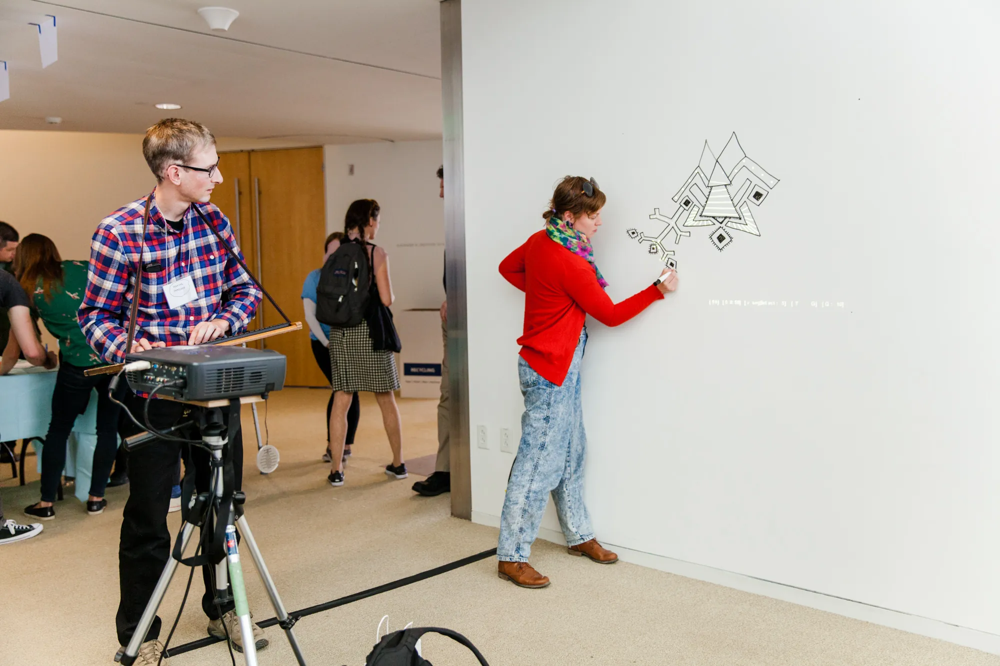
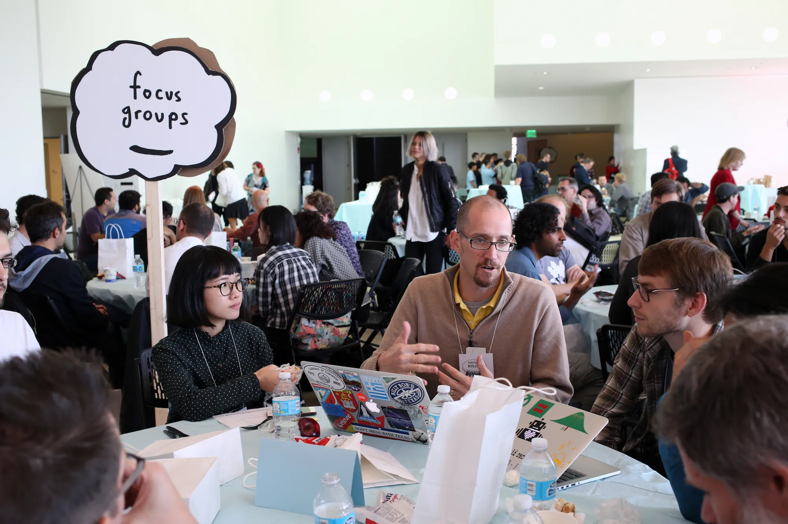
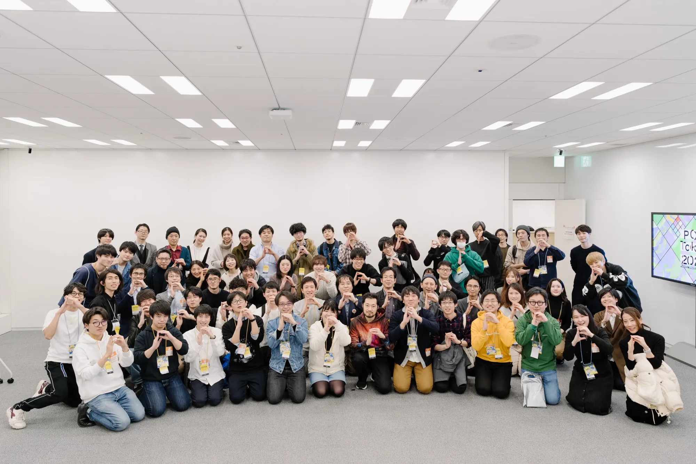
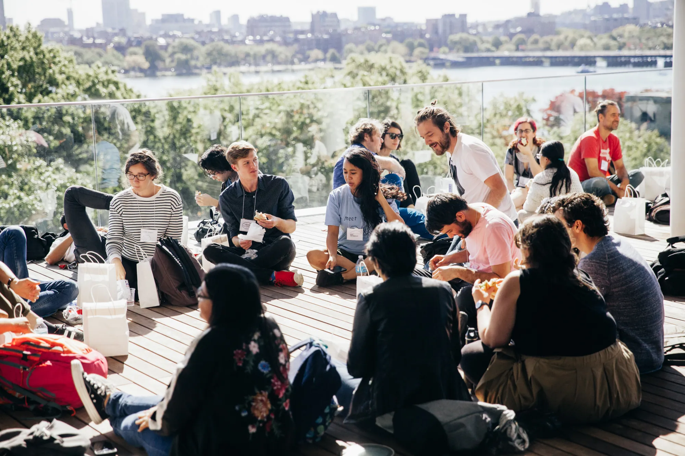
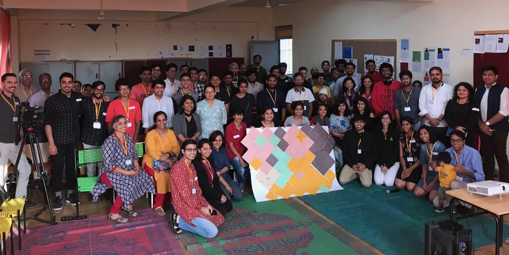

You do not need to be a photographer to take good photos of your Processing Community Day. The goal is simply to capture a record of the event to share the wider community. It doesn't need to be perfect!

This guide is for organizers, volunteers, or participants who may end up taking photos with whatever camera or phone they have available. Using the tips below will help you get better results without needing much photography experience.

## In brief

Don't worry about documenting everything. **If you only take one photo, make it a group photo with as many participants as possible.** Plan a moment for it in advance so people know when and where to gather.

If you can take a few more photos, aim for:

* **One group photo** of the participants
* **One wide photo** showing the venue and atmosphere
* **A few photos of people taking part**, such as coding, talking, presenting, making, or collaborating
* **A few photos of projects or activities**
* **One photo that clearly identifies the event as PCD**, such as signage, a poster, or Processing/p5.js on a screen

A smartphone is completely fine. Take several versions of important photos, try to take photos when people are emoting (smiling, laughing, etc), respect anyone who does not want to be photographed, and don't feel that you need to have the camera out all day.

The rest of this guide contains practical tips for getting better results without needing much photography experience.

For group photos, a slightly elevated position can make it easier to see everyone clearly — PCD @ Los Angeles

## Equipment Preparation

1. **Camera:** A DSLR, mirrorless camera, or a recent smartphone camera all work well. Use whatever you are comfortable with.

2. **Lens:** If using a camera with interchangeable lenses, a standard zoom lens such as a 24–70mm is a useful all-round option for photographing people, activities, and the venue.

3. **Memory Cards:** If using a camera, make sure you have enough storage space for the whole event.

4. **Battery:** Fully charge your camera or phone before the event. Bring spare batteries or an external battery pack if possible.

5. **Tripod or Monopod:** These can be useful in low-light spaces, for recording presentations, or for photographing installations.

6. **External Flash:** Flash can help in dark spaces, but use it only when necessary. It can be distracting during talks, workshops, performances, and other activities.

## Before the Event

1. **Scout the Location:** If possible, visit the venue beforehand or arrive early enough to look around. Check the lighting, possible shooting positions, and places where you can move without disturbing participants.

2. **Understand the Program:** Different PCD activities need different kinds of documentation. A workshop may call for close-ups of people making things and working together. A talk may need photos of both the speaker and audience. Exhibitions, performances, installations, and live coding sessions may require wider shots showing the work in context.

3. **Know the Schedule:** Identify the moments you particularly want to document, such as opening remarks, workshops, performances, presentations, breaks, and the group photo.

4. **Know Who Is Involved:** Familiarize yourself with the organizers, speakers, facilitators, performers, volunteers, and other people who are part of the program so you can make sure their contributions are represented.

5. **Plan the Group Photo:** If you want a photo with all participants, decide roughly when and where it will happen. It is much easier to gather everyone if the organizers announce it in advance.

6. **Check Photo Preferences:** Find out how your event will communicate photography preferences. This could include colored stickers, badges, lanyards, or another opt-out system. Make sure whoever is taking photographs understands it.

7. **Coordinate With the Organizers:** Discuss any areas, activities, artworks, or participants that should not be photographed. Make sure the photographer knows who to ask if a question comes up during the event.

Look for moments when participants are sharing their work with each other — PCD Boston.

## During the Event

* **Arrive Early:** Photograph the venue, signage, installations, and setup before participants arrive. These photos can help tell the story of the event.

* **Check In With the Organizers:** Confirm that nothing has changed regarding photography restrictions or the schedule.

* **Keep It Simple:** If you are not comfortable with manual camera settings, use automatic or semi-automatic modes. A well-timed smartphone photo is more useful than a technically perfect photo you missed while adjusting settings.

* **Take Several Shots:** People blink, move, or look away. Taking a few versions of important moments gives you more options later.

* **Vary Your Shots:** Try to capture a mix of wide photos showing the whole space, medium shots of small groups, and close-ups of people, projects, screens, materials, and details.

* **Focus on Participation:** PCD is about people making, learning, sharing, experimenting, and spending time together. Look for moments that show these activities rather than photographing only speakers or formal parts of the program.

* **Show the Work:** Photograph sketches, installations, projections, performances, hardware projects, drawings, workshop materials, and other things participants are creating.

An over-the-shoulder shot is useful for showing both a participant and their work — PCD São Paulo.

* **Capture Key Moments:** Document opening remarks, talks, workshops, performances, demonstrations, presentations, and other important parts of the program.

* **Capture the Community:** Look for conversations, people helping one another, small groups working together, people showing projects to each other, and informal moments between scheduled activities.

* **Be Mindful of Lighting:** Use natural or existing light when possible. In dark spaces, try changing your position or adjusting your camera settings before using flash.

* **Move Around:** Different parts of the room can tell different parts of the story. Move occasionally, but avoid constantly circulating or making participants feel watched.

* **Be Privacy-Conscious:** Respect any system used to indicate that someone does not want to be photographed. Avoid including those participants, especially in close-up photographs. It is usually easier to leave someone out of the frame than to edit them out later.

* **Be Respectful:** Photography should document the event without interfering with it. See the section below for more guidance.

Capture people in the middle of an activity, rather than waiting for them to pose — PCD @ Boston.

## Specific Shots to Consider

You do not need every kind of photograph on this list. Think of it as a checklist for creating a varied record of your PCD.

* **Venue Shots:** Photograph the space before and during the event. Include the entrance, rooms, tables, projections, installations, and anything that gives a sense of the location.

* **PCD Signage:** Capture posters, signs, programs, badges, stickers, or screens that identify the event as part of Processing Community Day.

* **Arrival Shots:** Photograph people arriving, registering, meeting one another, or looking through the program.

* **Organizer and Volunteer Shots:** Document some of the people making the event possible, including setup and behind-the-scenes work.

* **Speaker and Facilitator Shots:** Take photographs of people presenting, teaching, facilitating discussions, or introducing activities. Try to include some photos that also show the audience or activity around them.

* **Processing in Use:** Look for Processing, p5.js, or related tools being used on laptops, projections, installations, workshops, performances, or other projects.

* **Audience Shots:** Photograph people listening, responding, asking questions, laughing, applauding, or engaging with a presentation.

* **Interaction Shots:** Capture people talking, collaborating, helping one another, sharing work, or looking at projects together.

* **Workshop Shots:** Photograph both the overall workshop and smaller details such as hands working, sketches on screens, notes, materials, and conversations between participants.

* **Artwork and Project Shots:** Document installations, creative coding projects, performances, projections, physical computing projects, and other work being presented. When appropriate, make sure you know who created the work so it can be credited later.

* **Candid Shots:** Look for spontaneous moments of curiosity, concentration, surprise, laughter, or connection.

* **Detail Shots:** Photograph small things that help tell the story, such as stickers, name badges, code on screens, drawings, cables, workshop materials, signage, printed programs, or objects participants have made.

* **Group Photos:** Take photographs of organizers, volunteers, workshop groups, or the whole event. A photo with all participants is especially useful for documenting a PCD, but it requires some planning. See the tips below.

* **Closing Shots:** Document the end of the event, including final presentations, farewells, packing up, or the organizers and volunteers after the event has finished.

People talking, listening, and gesturing makes for a more engaging photo — PCD @ Boston

## Be Respectful

Photography should not interfere with people's ability to participate in or enjoy the event.

* **Respect Photo Preferences:** Follow any system the organizers use to indicate who does not want to be photographed, such as colored stickers, badges, or lanyards. When in doubt, ask before taking a close-up or portrait.

* **Give People Space:** Avoid getting too close to participants or repeatedly photographing the same person. Be especially mindful when people are concentrating, having a private conversation, eating, or taking a break.

* **Don't Photograph Continuously:** Choose moments when photography makes sense, take the photos you need, and then put the camera down for a while. Participants should be able to relax and take part without feeling like they are constantly being observed.

* **Don't Disrupt Activities:** Avoid blocking views, standing between a presenter and the audience, interrupting conversations, or moving around in ways that distract from what is happening.

* **Ask Before Staging Photos:** If you want someone to pose, move somewhere, hold something, or repeat an action for a photograph, ask first. People should feel free to decline.

* **Be Mindful of Sensitive Moments:** Not every moment needs to be documented. If someone appears uncomfortable, upset, or otherwise vulnerable, do not photograph them.

* **Respect Accessibility Needs:** Do not obstruct accessible routes, seating, interpreters, captioning screens, quiet spaces, or other accessibility arrangements while trying to get a better angle.

* **Accept "No" Immediately:** If someone asks not to be photographed, turns away, or otherwise indicates discomfort, stop photographing them. If someone asks for an existing photograph of them not to be shared, communicate that request to the organizers.

* **Remember That Participation Comes First:** The photographer is there to document the event, not direct it. If getting a photograph would interfere with someone's experience, let the photo go.

## Tips for a Good Group Photo

* **Plan the Moment:** Choose a time when most participants are likely to be present. Announce the group photo in advance rather than trying to gather everyone unexpectedly.

* **Choose the Location in Advance:** Find a spot with enough room for the whole group and a background that is not too distracting. Including something that identifies the event or location can help give the photo context.

* **Get Some Height:** For large groups, position yourself above the group or arrange people on a large staircase if one is available. This makes it much easier to keep everyone's face visible.

For group photos, you can try giving everyone the same simple action or gesture — PCD @ Tokyo 2020 (credit: Naoto Hieda)

* **Check the Light:** Avoid strong backlighting or direct sunlight that makes people squint. Even, soft light is usually easier to work with.

* **Arrange People Clearly:** Ask taller people to stand toward the back and shorter people toward the front. Keep people reasonably close together so the group does not look scattered.

* **Make Sure Everyone Is Visible:** Ask everyone to check whether they can see the camera lens. A useful instruction is: **"If you can see the lens, the lens can see you."** People in the back rows can then adjust their position instead of being hidden behind someone else.

* **Get Everyone's Attention:** Clearly say when you are about to take the photograph and count down so everyone knows where to look.

* **Take Several Photos:** Take several shots. Someone will almost certainly blink, look away, or move.

* **Take a Fun One:** After the regular group photo, you can ask, *"Let's do a silly one!"*. Yes, it is a bit cliché but it often produces a more interesting picture. Take a few more candid shots *after* the "silly" one too, as people often relax and smile more naturally afterwards.

* **Take More Than One Composition:** If time allows, take both a wider photograph showing the setting and a tighter one focused on the group.

* **Respect Photo Preferences:** Never pressure someone to join the group photo. Make sure people who have opted out of photography are not included unless they explicitly choose to participate.

Breaks can also show the atmosphere of an event. Just make sure to respect everyone's photo preferences — PCD @ Boston

## After the Event

1. **Back Up Your Photos:** Transfer the photographs from your camera or phone somewhere safe soon after the event.

2. **Review and Select:** You do not need to share everything. Choose a smaller set that represents the range of activities, participants, projects, and atmosphere of the event.

3. **Make Basic Edits:** Adjust exposure, cropping, or color when needed. Heavy editing is usually unnecessary.

4. **Check Privacy:** Before sharing photographs publicly, look again for participants who opted out of photography. If someone was captured accidentally, choose another image when possible. If the photograph must be used, obscure identifying features as appropriate.

5. **Add Credits:** When sharing photographs of artworks, projects, performances, or presentations, include the creator's name when possible. Credit the photographer as well if requested.

6. **Share With the PCD Team:** Keep the original files and your selected/edited photographs in separate folders. Share your selected photographs with the Processing Foundation using the method provided to PCD organizers so they can potentially be included in documentation of PCD events around the world.

A few good photographs are more valuable than hundreds of similar ones. Focus on documenting what made your PCD distinctive: the people, the work they shared, the activities they took part in, and the community that formed around the event.

Don't forget to enjoy the moment! It's not just about the photos — PCD @ Bangalore
