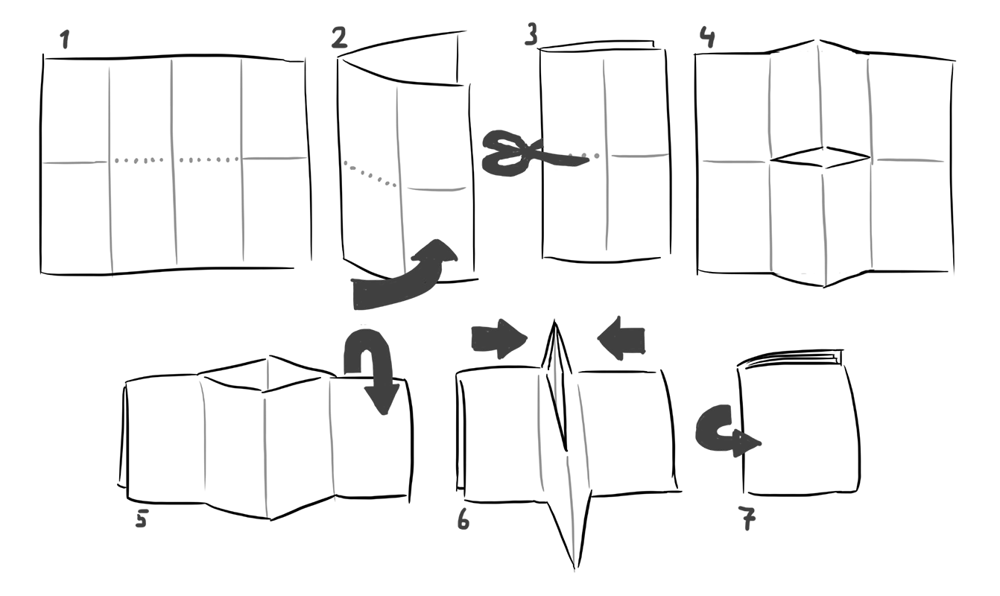

## What is a Zine?

A [zine](https://en.wikipedia.org/wiki/Zine) (pronounced “zeen”, as in "magazine") is a small, independent publication usually in a small booklet format, made by hand, photocopied, or shared online. A great thing about zines is that they are easy to make and inexpensive to produce. Zines are usually created by individuals or small groups and are typically distributed in small quantities, through local communities, events, or online platforms.

## What kind of zine works well for PCD?

For PCD, we encourage you to create a zine that can be used as a guide by other PCD organizers or participants. Think of it as support material for an activity that could be completed in 1 to 3 hours. It could be a tutorial, a series of discussion questions, an art/code assignment, or any other kind of activity that can be completed in a group or individually. Some might need a facilitator to guide the activity. Others could be completed independently. It's up to you!

And if you'd rather use a ready-to-print zine, you can find one in our [Zine Library](/organize/zines/zine-library/).

A minizine is printed on a single sheet of paper and folded into a small 8-page booklet.  Illustration by [1pagedungeons](https://1pagedungeons.itch.io/) ([CC BY-SA 4.0](https://creativecommons.org/licenses/by-sa/4.0/))

## How to Make a Zine

I highly recommend starting with Neta Bomani's [How to Plan a Zine Project](https://www.brooklynmuseum.org/en-GB/stories/how-to-plan-zine-project). It's a short and very practical guide. You can also download it as a printable zine [here](https://d1lfxha3ugu3d4.cloudfront.net/article/images/Neta_Bomani_Zine_3.pdf). Thanks to Roopa Vasudevan for pointing me to it!

This [wikiHow article](https://www.wikihow.com/Make-a-Zine) is an illustrated step-by-step guide to making a zine and a good starting point. If you prefer a video tutorial, try [How to Make a Zine](https://www.youtube.com/watch?v=ab4O9SWNl9g) by Austin Kleon on YouTube.

### Choosing a topic

One way to pick a topic is to think of something you know a lot about, or something you want to learn more about. Then boil it down to a single idea. How about a zine on the concept of a *variable*? A zine on *rotation*? Or a zine on using *code comments as poetry*?

If you are organizing a PCD yourself, are there any topics that you'd like participants to discuss? This could be a starting point for your zine. How would you like people to engage with that topic or conversation? How might that translate into the zine format?

Alternatively, you could create a zine that is a collection of smaller ideas or prompts, in the spirit of Yoko Ono's [Grapefruit](https://en.wikipedia.org/wiki/Grapefruit_(book)), or Brian Eno's [Oblique Strategies](https://en.wikipedia.org/wiki/Oblique_Strategies).

Remember that a zine is usually small, so make sure to keep it focused. If you have more to share, you can always create multiple zines!

### Print and test it

If you are making your zine digitally, it's a good idea to print it out, fold it, and read it yourself before submitting it to the Zine Library. Make sure the text is large enough to read, that the pages are in the right order, and that everything else looks good on the printed version. If possible, include a monochrome version of your zine, as it will make it easier to print (ever run out of color ink?) and to photocopy.

### Use QR codes for links

A printed URL isn't clickable, so if you want to include a link in your zine, consider adding a QR code. You can use [this p5.js sketch](https://editor.p5js.org/SableRaf/sketches/fr3vzCehC) to generate a QR code for any URL.

## Resources

### Zine Tutorials

- [Wuthipol Designs](https://www.instagram.com/wuthipol.designs/reels/) on Instagram shares zine templates and tutorials like [this one](https://www.instagram.com/reels/C7EOqcryOZU/) for making a 16-page zine from a single sheet of paper.
- [Bre's Zine Resources](https://docs.google.com/document/d/11Lc8s3w5HLrs8ekKiIGrbxNjVUV591MRvLdIOp_5fiA/)

### Software Tools

- [p5.(gen)zine](https://github.com/munusshih/p5.genzine) by Munus Shih and Iley Cao is an open-sourced and friendly p5.js library for zine-making.
- [The Electric Zine Maker](https://alienmelon.itch.io/electric-zine-maker) by alienmelon is a printshop and art tool for easily making and printing zines. 
- [Zine Arranger](https://nashhigh.itch.io/zinearranger) by Nash Hight, arranges multi-page PDF files into a printable zine layout.

### Zine Archives

- [Tiny Tech Zines](https://tinytechzines.bigcartel.com/) 
- [Zine Libraries of The World](https://zines.barnard.edu/zine-libraries) by Barnard Zine Library
- [Solidarity! Revolutionary Center and Radical Library](https://archive.org/details/solidarityrevolutionarycenter)
- [ZineWiki](https://web.archive.org/web/20250320022039/https://zinewiki.com/) on the Internet Archive.

## Other Inspiration

[Code as Creative Medium: A Handbook for Computational Art and Design](https://mitpress.mit.edu/9780262542043/code-as-creative-medium/) is a book by Golan Levin and Tega Brain that features classic creative coding prompts and assignments, together with examples of artworks, and interviews with creative code educators.

[Draw It With Your Eyes Closed: The Art of the Art Assignment](https://shop.nplusonemag.com/products/draw-it-with-your-eyes-closed-the-art-of-the-art-assignment) is an anthology of essays, assignements, anti-assignments, and stories by over a hundred artists, teachers, and students. It is a great source of inspiration for creating your own art assignments.

## Submit Your Zine

Go to the [Zine Library](/organize/zines/zine-library/) to submit your zine and explore the full collection.